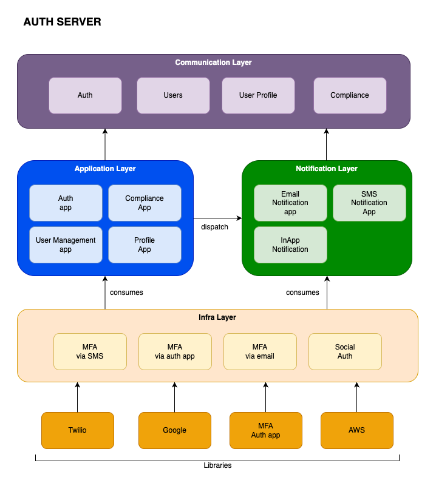

# System Architecture Layers — Overview

This document provides a high-level architecture of the **Auth Server** as a distributed, modular system composed of specialized layers. These layers are logical boundaries that organize the system’s responsibilities and behaviors. They are not tied to a specific technology or framework, but instead define the scope and flow of concerns across the platform.

---

## 🧩 Layer-to-Apps Mapping

The following table maps the concrete applications and libraries planned in this project to their respective architecture layers:

| Layer                          | Applications / Libraries                                                  |
|--------------------------------|---------------------------------------------------------------------------|
| 📡 Communication Layer         | `apps.auth`, `apps.users`, `apps.permissions`, `apps.compliance`         |
| 🔔 Notification Layer          | `apps.notifications`, `libs.mailer`, `libs.twilio`                       |
| 🧠 Domain Layer                | All `apps.*`, especially `apps.permissions`, `apps.users`, `apps.auth`   |
| 🏗 Application Orchestration   | `apps.auth`, `apps.webhooks`, `apps.permissions`, `apps.notifications`   |
| 🧱 Infrastructure & Integration| `libs.aws`, `libs.mailer`, `libs.twilio`, `libs.totp`                    |
| 🧩 Configuration & Environment | All apps (via `.env` files or settings-based wrappers)                   |
| 📚 Audit & Compliance Layer    | `apps.compliance`, `apps.webhooks`, request logging across all apps      |

> 🔗 See `README.md` and `XX-*.md` files for the complete breakdown of responsibilities and documentation per app.

## 🖼️ System Architecture Diagram

The following diagram illustrates the modular structure and key components of the system, organized across infrastructure, application, notification, compliance, and communication layers:

## 📡 1. Communication Layer

Responsible for handling inbound and outbound communication between clients (applications, browsers, devices) and the platform.

- Handles:
  - HTTP(S) requests and responses
  - REST API endpoints
  - Cookie-based session flows
  - CORS and CSRF validation
- Interfaces:
  - Frontend web clients (HTML forms, JS calls)
  - Mobile or third-party apps via API
- Concerned with:
  - Protocol-level security (HTTPS, headers)
  - Rate-limiting and throttling
  - Request parsing and input validation

---

## 🔔 2. Notification Layer

Handles all outbound messaging and alerts to end users and administrators.

- Types of notifications:
  - Email (e.g., verification, new device alert)
  - SMS (e.g., MFA codes)
  - Optional push/webhook integrations
- Ensures:
  - Delivery reliability
  - Auditable log of outbound messages
  - Flexible messaging templates and internationalization

---

## 🧠 3. Domain Layer

Encapsulates the core business logic and policies of the system.

- Manages:
  - User lifecycle (registration, profile, verification)
  - Authentication logic (passwords, MFA, sessions)
  - Authorization model (roles, scopes, permissions)
- Pure logic with no knowledge of infrastructure or protocols
- The most testable and stable part of the system

---

## 🏗 4. Application Orchestration Layer

Coordinates use cases by combining domain logic and infrastructure.

- Provides:
  - Services for login, token issuance, verification flow, etc.
  - Enforcement of system-wide policies and feature flags
  - Flow logic based on user/account/system state
- Converts abstract intent into actionable steps across components

---

## 🧱 5. Infrastructure & Integration Layer

Provides access to external systems, persistence, and cryptographic tools.

- Includes:
  - Database adapters (PostgreSQL, Redis)
  - Email and SMS providers
  - OAuth2 identity provider integrations (e.g., Google)
  - JWT signing and encryption utilities
- Implements interfaces used by orchestration and domain logic

---

## 🧩 6. Configuration & Environment Layer

Centralizes all runtime configuration and feature flag management.

- Covers:
  - System feature toggles (MFA, auto-reg, verification)
  - Environment secrets (keys, credentials)
  - Deployment-dependent behavior (dev/stage/prod differences)

---

## 📚 7. Audit & Compliance Layer

Ensures operational visibility, logging, and traceability.

- Captures:
  - Security-critical events (logins, reauth, token activity)
  - Administrative actions and permission changes
  - Delivery confirmation of notifications
- Supports:
  - Alignment with OWASP, SOC 2/3 principles
  - Integration with monitoring/alerting stacks

---
